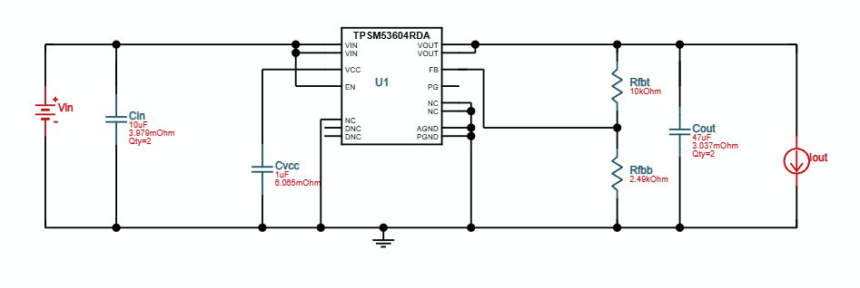

## 21/07/2025 Research

Did some research on power modules trying to find one with adjustable output voltage at least 3A power and a input voltage range of hopefully input min< 2.5v input max > 20v

- https://lcsc.com/datasheet/lcsc_datasheet_2410121525_LOWPOWER-LP6216B6F_C517048.pdf
- https://au.mouser.com/ProductDetail/Monolithic-Power-Systems-MPS/MP28167GQ-B-Z?qs=efUn273yAhft6LUdJXY37A%3D%3D

If i don't go adjustable these parts look good:

- https://au.mouser.com/ProductDetail/Analog-Devices-Maxim-Integrated/MAX25239AFFB-VY%2b?qs=tlsG%2FOw5FFic%252BAdoCbCVCQ%3D%3D
- https://au.mouser.com/ProductDetail/Texas-Instruments/TPS55165QPWPTQ1?qs=W0yvOO0ixfFtQZbs3ZYckw%3D%3D (can do 5v or 12v)

## 22/07/2025 Research

I made some criteria for power modules

- must be buck-boost / sepic for step-up / step-down capabilities and needs positive output
- I > 3A
- V in min <= 2.5v ~ 12v< max
- V out is adjustable (min <= 3.3v max >= 9v) or a list 3.3v, 5v, 9v
- Usb v in = 9v, 12v or 15v
- Battery voltages can be 3.7, 7.4, 11.1, 14.8

I think ill use this as can start with 2.9v then rundown to 1.9v
https://www.ti.com/lit/ds/symlink/lm5157.pdf

which is similar to

https://www.ti.com/lit/ds/symlink/lm51571-q1.pdf?ts=1753170329297&ref_url=https%253A%252F%252Fwww.ti.com%252Fproduct%252FLM51571-Q1%252Fpart-details%252FLM51571QRTERQ1

## 27/07/2025 Research

The lower input voltage side makes it very hard to design as for a boost from 2.5v to 5v at 4A would require a input amperage of 10A i think so just going to do buck

I used https://webench.ti.com/power-designer/switching-regulator/ to design a regulator it recommended using https://lcsc.com/product-detail/DC-DC-Converters_TI-TPSM53604RDAR_C2868001.html?s_z=n_TPSM53604RDA

